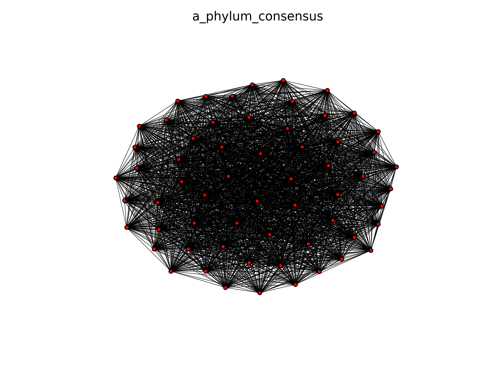
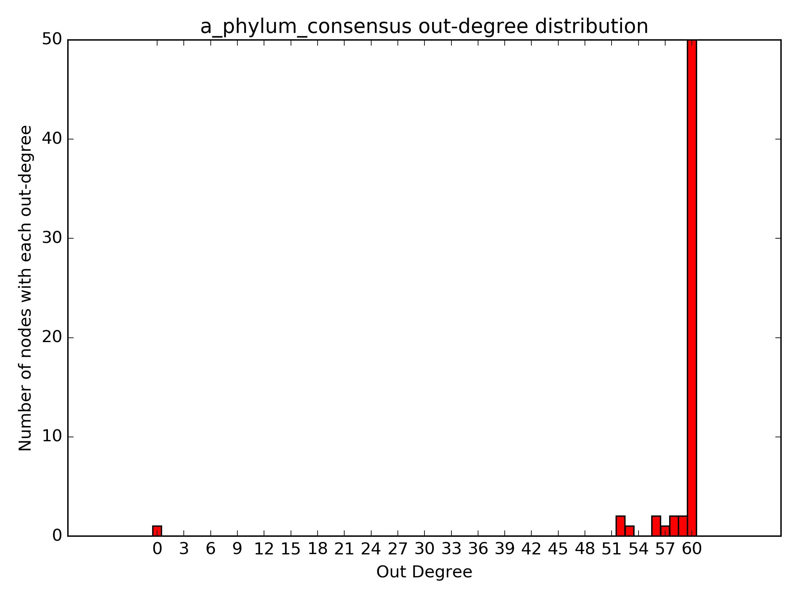

  

# **Net**work **An**alyzer

### Authors: Maribel Hernández Rosales(1), Marcos González Laffitte (1), Valerie de Anda (2) 

1. Instituto de Matemáticas, Universidad Nacional Autónoma de México, Mexico
2. University of Austin at Texas. Marine Science Institute.  


We provide a single script  that use the output derived from [Metamis sofware](https://www.ncbi.nlm.nih.gov/pubmed/27887570) sofware,  which is a directed network , and compute several statistics 
Please note that any **networked from another software can also be used** ie [WGCNA: Weighted Correlation Network Analysis](https://cran.r-project.org/web/packages/WGCNA/index.html), [MENA:Molecular Ecological Network Analyses](http://129.15.40.240/mena/). 
Please note that your input file must have(.txt) extention 


# Cite

The software implementation is described in  

[De Anda et al., 2018. Understanding the mechanisms behind the response to environmental perturbation in microbial mats: a metagenomic-network based approach.Front. Microbio](https://www.frontiersin.org/articles/10.3389/fmicb.2018.02606/abstract)


## Example of directed network 

Separated by tab 

```
Firmicutes      Ascomycota      -0.000272753971115013
Firmicutes      Chlorobi        -0.000242343947634859
Firmicutes      Ignavibacteriae 0.000178797125901064
Firmicutes      Dikarya unclassified    -0.00017738367107812
Firmicutes      Candidatus Beckwithbacteria     -0.000173505314274337
Firmicutes      Candidatus Woesebacteria        -0.00015914042503068
Firmicutes      Bacteroidetes/Chlorobi group unclassified       -0.000153790507711771
Firmicutes      Armatimonadetes 0.000145294003838928
Firmicutes      Cloacimonetes   -0.000130612871481698
Firmicutes      Candidatus Shapirobacteria      -0.00013061259484347
```

## Example of undirected network 

Separated by tab

```
Firmicutes	Actinobacteria
Ascomycota	Nitrospinae
Firmicutes	Candidatus Magasanikbacteria
Ascomycota	Candidatus Pacebacteria
Actinobacteria	Candidate division CPR2
Bacteria unclassified	Dikarya unclassified
Actinobacteria	Thermotogae
Bacteria unclassified	Ignavibacteriae
Bacteria unclassified	Candidatus Beckwithbacteria
Actinobacteria	Patescibacteria group unclassified
```

The main script :  [NetworkAnalysis.py](./scripts/NetworkAnalysis.py) recieves the above mentioned files and compute several topological features such as density, mean degree, hubs, connected components, clustering coefficient modularity etc.  


# Dependencies 

In order to use the script, the following dependencies must be installed first.
1. [ Python3  ](https://www.python.org/)
2. [Networkx](https://networkx.github.io/) 
3. [Community library](https://github.com/taynaud/python-louvain/) 

```
sudo -H pip install python-louvain
```

Some extra python libreries 

Numpy and matplotlib
```
sudo pip2 install numpy matplotlib
```
Librarpy tk 

```
sudo apt-get install python-tk
```

# Running the script     
```
python Networks/scripts/NetworkAnalysis.py -d Networks/data/a_phylum_consensus.txt
```
In the case of having  undirected networks , you can use the  -u option
```
python Networks/scripts/NetworkAnalysis.py -u Networks/data/a_phylum_consensus.txt
```

# Analyzing the output 

Once the program has finished, the following message will appears in the terminal
```
Analysing Network:    Networks/data/a_phylum_consensus.txt    type:   Directed
        - Parsing file to network ...
        - Obtaining order ...
        - Obtaining size ...
        - Obtaining diameter (for undir network version) ...
        - Obtaining radius (for undir network version) ...
        - Obtaining density ...
        - Obtaining mean degree ...
        - Obtaining max degree ...
        - Obtaining mean clusttering coefficient ...
        - Obtaining hubs ...
        - Obtaining mincut vertex set (for undir network version) ...
        - Obtaining mincut edge set (for undir network version) ...
        - Obtaining connected components ...
        - Obtaining strongly connected components (just for directed case) ...
        - Obtaining maximal cliques (for undir network version) ...
        - Obtaining cycle basis (for undir network version) ,,,
        - Obtaining maximal independent set ...
        - Obtaining degree distribution ...
        - Drawing in degree distribution ...
        - Drawing out degree distribution ...
        - Obtaining communities (for undir network version)...
        - Drawing networks ...
        - Running Random Network Analysis ...
        - Finished analysis for this network
```


If you did not have any problems with the dependencies, the following output files should have been generated

```
a_phylum_consensus_directed.txt
a_phylum_consensus_random_results.txt
a_phylum_consensus_distribution_indegree.png
a_phylum_consensus_distribution_outdegree.png
a_phylum_consensus_community_network.png
a_phylum_consensus_directed_network.png
```
The files containing  the statistical analysis are the folowing:  
```
cat a_phylum_consensus_directed.txt
```

```
Order:61
Size:3560
Diameter (Undirected):1
Radius (Undirected):1
Density:0.972677595628
Mean Degree:58
Max Possible Degree:60
Clustering Coefficient:0.5
Max Degree Hubs:
- Max In Degree: 60
- Number of Hubs with Max In Degree: 1
- Hubs with Max In Degree: Ignavibacteriae
- Max Out Degree: 60
- Number of Hubs with Max Out Degree: 50
- Hubs with Max Out Degree: Verrucomicrobia,Bacteroidetes,Parcubacteria group unclassified,Archaea unclassified,FCB group unclassified,Candidatus Kaiserbacteria,Ascomycota,Chlorobi,Actinobacteria,Marinimicrobia,Terrabacteria group unclassified,Patescibacteria group unclassified,Candidatus Peregrinibacteria,Armatimonadetes,Eukaryota unclassified,Bacteria unclassified,Dikarya unclassified,Bacteroidetes/Chlorobi group unclassified,Candidatus Magasanikbacteria,Candidatus Rokubacteria,Cloacimonetes,Nitrospinae,Candidate division CPR2,Firmicutes,Deinococcus-Thermus,Proteobacteria,Candidatus Gottesmanbacteria,Spirochaetes,Candidatus Woesebacteria,Candidatus Poribacteria,Nitrospirae,Candidatus Aminicenantes,Chloroflexi,Planctomycetes,PVC group unclassified,Candidatus Uhrbacteria,Fusobacteria,Candidatus Beckwithbacteria,Synergistetes,Unclassified Bacteria unclassified,Gemmatimonadetes,Chlamydiae,Nanoarchaeota,Cyanobacteria,Microgenomates group unclassified,Bacteria candidate phyla unclassified,Thermotogae,Acidobacteria,Thaumarchaeota,Euryarchaeota
```


The same statistics but in   1000 random networks with the same number of nodes and edges.  
```
cat a_phylum_consensus_random_results.txt
```

```
Random Analysis Results, Mean Measures:                 runs(100)
 - [/] order:   61
 - [/] size:    3560
 - [u] diameter:        1.79
 - [u] radius:  1.0
 - [d] density: 0.972677595628
 - [d] mean degree:     58.0
 - [d] clustering coefficient:  0.499653314753
 - [d] maximum in degree:       60.0
 - [d] maximum out degree:      60.0
 - [d] hubs with max in degree: 11.4
 - [d] hubs with max out degree:        11.41
 - [u] modularity:      0.0
 - [u] number of communities:   1.0
 - [/] number of connected components:  1.0
 - [d] number of strongly connected components: 1.0
 - [u] number of cycles in cycle basis: 1768.73

[u] undirected associated graph
[d] directed graph
[/] both undirected and directed

```

# Overal network 

  

# In degree distribution
  

# Outdegree distribution
  


### If you want to customize your networks..

We recomend to use [visNetwork](https://datastorm-open.github.io/visNetwork/). 
We provide a simple data test  containing the nodes and the edges and the [R script](./scripts/plot_graph.R)
to obtain the following [interactive graph](https://valdeanda.github.io/NetAn/testNetwork.html)

